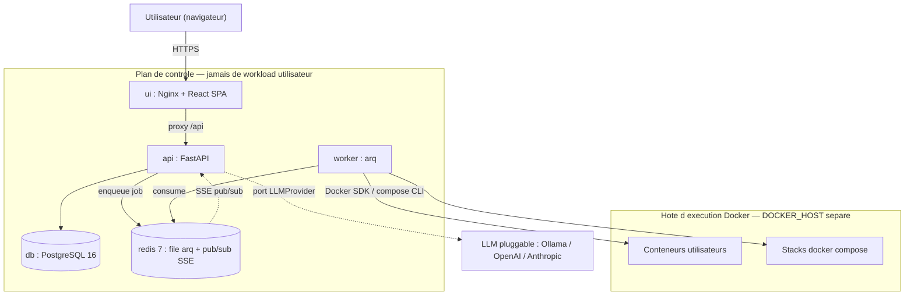

# 📐 Diagrammes d'architecture — StackNest

Schémas d'architecture du projet. La **source de vérité** est le fichier Mermaid
[`architecture.mmd`](architecture.mmd) (versionné, diff-able), décliné en image éditable Excalidraw
pour le dossier de rendu et les slides.

## Schéma principal — plan de contrôle vs hôte d'exécution

> **Idée clé** : le **plan de contrôle** (api, db, redis, worker) ne fait *jamais* tourner les
> workloads utilisateurs. Le `worker` pilote un **hôte Docker séparé** via `DOCKER_HOST` (socket local
> en dev, `ssh://…` en preview/prod). Isolation par conception.

## 🎨 Obtenir / éditer la version Excalidraw

Excalidraw importe nativement le Mermaid — pas besoin de tout redessiner :

1. Ouvrir [excalidraw.com](https://excalidraw.com).
2. Menu **« + »** (en haut à gauche) → **« Mermaid to Excalidraw »**.
3. Coller le contenu de [`architecture.mmd`](architecture.mmd) → **Insert**.
4. Repositionner / coloriser selon la charte (bleu nuit `#032233`, cyan `#0d9297`, jaune `#fea21f`),
   puis **exporter** :
   - `architecture.excalidraw` (scène éditable, à committer ici) ;
   - `architecture.png` (pour le dossier de rendu / les slides).

> Toute évolution de l'archi se fait **dans `architecture.mmd`** (source versionnée), puis on
> régénère l'Excalidraw/PNG depuis cette source. On garde ainsi un diff lisible dans git.
