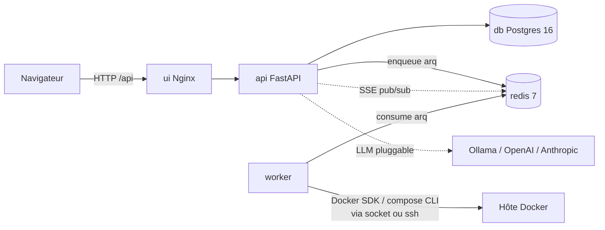

# StackNest — Rapport technique

> Dossier de rendu — oral jury EPSI Open Innovation.
> Document reflétant l'état **réel** du code à la date de rédaction (branche `main`).

---

## 1. Résumé exécutif

**StackNest** est une *Internal Developer Platform* (IDP) qui permet à une équipe technique de
provisionner des ressources IT (bases de données, caches, services, runtimes) **en autonomie**,
sans ticket Ops, via deux portes d'entrée : une **interface web** (catalogue + formulaires) et un
**assistant IA conversationnel** (« déploie-moi un PostgreSQL 16 »).

Le MVP livré couvre la chaîne complète :

- **Catalogue** de **45 templates** réels (métadonnées publiques), avec versions et indicateurs
  LTS/EOL, et **gates de déployabilité** : 31 ressources Docker provisionnables, 14 cartes
  visibles mais bloquées (10 ressources Terraform + 4 runtimes langage).
- **Déploiement Docker live** d'une ressource via le **Docker SDK** (docker-py), avec suivi temps
  réel en SSE et **cycle de vie complet** (créer / arrêter / démarrer / régénérer le secret / détruire).
- **Composeur de stack Docker Compose** : un *builder* où l'on assemble N services, on déclare des
  **liens** entre eux (câblage de variables d'environnement `{to.*}`), et on déploie le tout comme
  un projet `docker compose`.
- **Chat IA** *guidé avec confirmation*, qui propose aussi bien le **déploiement d'un service** que
  la **composition d'une stack**, derrière une défense anti-hallucination.
- **Authentification** complète (JWT access/refresh, vérification d'email, mot de passe oublié),
  **dashboard** et **actions en masse** sur les listes.

Le projet est développé en **TDD strict** (Red → Green → Blue), avec **1 184 tests backend**
(pytest) et **903 cas de test frontend** (Vitest), une CI GitHub Actions à lanes multiples, et une
**Clean Architecture vertical-slicing** appliquée côté back **et** front.

---

## 2. Contexte & problématique

Dans une équipe technique, obtenir une ressource (une base pour tester, un cache, un environnement
isolé) passe souvent par un **ticket Ops** : délai, dépendance à une personne, friction. À l'autre
extrême, laisser chacun lancer ses conteneurs « à la main » produit de l'hétérogénéité et des
erreurs (versions EOL, secrets en clair, ports en collision).

StackNest répond à ce besoin d'**autonomie encadrée** : un guichet unique (*Store*) où l'on choisit
une ressource d'un **catalogue maîtrisé**, où les versions et la sécurité sont cadrées par la
plateforme, et où l'on peut décrire son besoin **en langage naturel** sans connaître Docker. Le tout
**self-hosted** (coût = celui du serveur), à la différence des PaaS cloud facturés au service.

---

## 3. Personas & valeur

| Persona | Besoin | Valeur StackNest |
|---|---|---|
| **Lucas, 21 ans — étudiant** | Une BDD + un runtime en < 2 min pour ses projets, budget 0 €, aucune compétence infra | Provisionne depuis le catalogue ou le chat, 0 commande infra tapée |
| **Sarah, 32 ans — dev senior** | Un sandbox isolé avec BDD pour tester une migration sans impacter l'équipe | Déploiement isolé en minutes au lieu d'un ticket Ops de plusieurs jours |
| **Marc, 38 ans — lead dev PME** | Automatiser des envs de test sur un serveur local, budget < 50 €/mois | Plateforme self-hosted, pas de coût cloud par service |

**Différenciateur** : le **chat IA** qui traduit une intention en action réelle et sûre, et le
**composeur de stack** qui câble plusieurs services entre eux — là où les PaaS classiques restent
sur du « 1 service à la fois » manuel.

---

## 3 bis. Marché, positionnement & modèle économique

> Synthèse du volet business. Détail complet, tableau comparatif sourcé et grille freemium :
> `docs/rendu/business-strategie.md`. **Tarifs concurrents consultés le 14 juin 2026.** Le modèle
> hébergé + self-host est une **hypothèse stratégique** (à valider), pas un engagement produit du MVP.

### Problématique marché

Le besoin d'**autonomie encadrée** existe pour **deux publics** : l'**entreprise** (sortir du ticket
Ops sans tomber dans le « chacun ses conteneurs ») et l'**étudiant** (provisionner vite, gratuitement,
sans compétence infra pour ses TP). Le marché du déploiement self-service se segmente en trois
familles : **PaaS hébergés** (Railway, Render, Fly.io, Heroku, Koyeb), **IDP / platform engineering**
(Qovery, Northflank, Porter, Humanitec, Platform.sh) et **self-hosted open-core** (Coolify, Dokploy).
Tendance de fond : les **free tiers s'érodent** (Heroku a supprimé le sien en 2022, Fly.io n'en
propose plus aux nouveaux comptes).

### Concurrents & tarifs (consultés le 14 juin 2026)

| Concurrent | Modèle | Free tier | 1er payant |
|---|---|---|---|
| **Railway** | Hébergé | Essai $5 one-shot | Hobby $5/mois ; Pro $20/mois/siège + conso |
| **Render** | Hébergé | Hobby gratuit (750 h, Postgres exp. 30 j) | Starter $7/mois/service |
| **Fly.io** | Hébergé (usage) | Aucun (essai 2 h / 7 j) | ~$1,94/mois (conso min.) |
| **Heroku** | Hébergé | Aucun (supprimé nov. 2022) | Eco $5 ; Basic $7/mois |
| **Koyeb** | Hébergé (usage) | Starter gratuit (1 service + 1 Postgres, 1 user) | Pro $29/mois + conso |
| **Northflank** | Hébergé / IDP | Developer Sandbox (2 services, 1 DB, non-prod) | Developer $10/mois |
| **Qovery** | IDP (BYOC) | 1 000 min déploiement/mois | $29/user actif/mois + $0,016/min |
| **Platform.sh** | PaaS managé | Essai 30 j | Development €12,25 ; Essential €22/mois |
| **Porter** | IDP (BYOC) | Programme startup (25 vCPU/50 Go, 6 mois) | Team custom *(à re-vérifier)* |
| **Humanitec** | IDP grands comptes | — | Custom *(à re-vérifier)* |
| **Coolify** | Self-host open-core | Self-hosted gratuit à vie (Apache 2.0) | Cloud $5/mois (2 serveurs) |
| **Dokploy** | Self-host open-core | Self-hosted gratuit (open source) | Cloud $4,50/mois (1 serveur) |

### Différenciateurs StackNest

À l'intersection des trois familles : **simplicité d'un PaaS** + **cadrage d'un IDP** + **souveraineté
d'un self-hosted**, avec deux innovations — le **chat IA qui agit** (boîte à outils fermée + validation
déterministe + confirmation) et le **composeur de stack** multi-services (liens `{to.*}`) — et un
**freemium étudiant à 0 €**. Catalogue **maîtrisé** (versions, LTS/EOL, gates) là où les PaaS laissent
tout configurer.

### Stratégie d'insertion (bottom-up)

*Land-and-expand* par les étudiants : habituer les **étudiants** à StackNest sur leurs **TP** (gratuit)
→ ils deviennent **ambassadeurs** → une fois **embauchés**, ils **réintroduisent** l'outil en entreprise
→ l'entreprise adopte un **plan payant**. Modèle prouvé par Docker, GitHub, Notion, Figma. Leviers :
free tier non-prod, self-hostabilité (diffusion gratuite), ancrage académique EPSI, open-core.

### Modèle économique — freemium hébergé + open-core (hypothèse)

Principe : **assez gratuit pour qu'un étudiant fasse ses TP, pas assez pour qu'une entreprise y
échappe.** Grille proposée (prix = hypothèses à valider) :

| Plan | Cible | Prix | Justification benchmark |
|---|---|---|---|
| **Free** | Étudiant / TP | 0 € (non-prod, 1 user, quotas serrés) | Aligné Render Hobby / Northflank Sandbox / Koyeb Starter |
| **Pro** | Dev indé | ~9 €/mois/user | Sous Railway Pro ($20) / Koyeb ($29) |
| **Team** | PME / équipe | ~25 €/mois/user (SSO, RBAC) | Aligné Qovery ($29/user) / Render Standard ($25) |
| **Entreprise** | Grand compte | Sur devis (SLA, données dédiées, UE) | Cohérent Humanitec / Porter (custom) |
| **Self-hosted** | Labo / souveraineté | Gratuit (open-core) | Modèle Coolify / Dokploy |

L'offre **hébergée** porte le revenu récurrent (et la question RGPD/données cloud) ; l'offre
**self-hosted open-core** maximise la diffusion et nourrit le *land-and-expand*.

---

## 4. Périmètre livré (MVP) vs roadmap

### Livré (MVP — état actuel du code)

| Domaine | Livré |
|---|---|
| **Auth** | Inscription, **vérification email**, login JWT (access + refresh), logout, `/me`, mot de passe oublié + reset, RBAC admin/user, CLI `create-admin` |
| **Catalogue** | 45 templates, versions + LTS/EOL, filtres, détail, **gates de déployabilité** (Docker vs Terraform/runtimes), CRUD admin |
| **Déploiement** | Provisioning Docker SDK live, SSE temps réel, cycle de vie create/stop/start/regenerate/destroy, secret affiché une fois |
| **Stacks** | Composeur Docker Compose (services + liens `{to.*}`), déploiement projet compose, détail 2 niveaux (stack + page service), destroy `-v` |
| **Chat IA** | Assistant guidé + confirmation, actions `deploy` **et** `compose_stack` (+ stop/start/regenerate), streaming SSE, fils multiples, 3 adaptateurs LLM (Ollama/OpenAI/Anthropic) |
| **Dashboard** | KPIs + sections (front), agrégation des ressources actives |
| **Listes** | Actions en masse (bulk) sur déploiements et stacks |
| **Infra / Qualité** | Docker Compose (base + dev + preview), CI multi-lanes, worktrees multi-agents |

### Roadmap (post-jury)

- **v1.5 chat** : action IA `compose_stack` pré-remplissant le builder (déjà câblée au modèle).
- **v2 stacks** : cycle de vie **par service** (stop/start d'un service isolé), édition d'une stack
  déployée, répliques (scaling horizontal).
- **Déploiement** : vraie **pause** (`docker pause`), provider **Terraform/Proxmox** pour les VMs
  (les cartes Terraform sont déjà au catalogue, bloquées au MVP).
- **Auth** : MFA TOTP.
- **Sécurité** : 2ᵉ LLM « juge » relisant l'action avant la carte de confirmation.

---

## 5. Architecture

### 5.1 Monorepo modulaire

```
EPSI_OpenInnov-StackNest/
├── apps/
│   ├── api/                 # FastAPI (API + worker, même paquet `app/`)
│   ├── web/                 # React + Vite + TS (SEUL front de production)
│   └── web-mockup/          # Référence design (hors CI / quality gate)
├── infra/
│   └── terraform/           # environments/{dev,test,preview,prod} + modules/env
├── .github/workflows/       # ci.yml + ci-nightly.yml
├── docs/                    # specs, charte, reviews, rendu
├── docker-compose.yml       # base + overrides .dev / .preview
└── scripts/worktree.sh      # worktrees multi-agents
```

> Note d'écart honnête vs la spec d'origine : les fichiers `docker-compose*.yml` sont **à la racine**
> (et non sous `infra/docker/`), et le projet n'embarque **pas** de `version.json` — la version est
> injectée au build Docker (`APP_VERSION` / `GIT_COMMIT` / `DEPLOYED_AT`) et exposée par l'endpoint
> `GET /version`.

### 5.2 Services Docker Compose

| Service | Image | Rôle |
|---|---|---|
| **db** | `postgres:16-alpine` | Source de vérité : users, catalogue, déploiements, stacks, conversations |
| **redis** | `redis:7-alpine` | File de jobs `arq` (API → worker) + pub/sub SSE |
| **migrate** | image API (one-shot) | `alembic upgrade head` + `seed-catalog` avant démarrage de l'app |
| **api** | `python:3.13` + uv | Logique métier, auth, catalogue, orchestration, SSE |
| **worker** | image API + plugin `docker compose` | Consomme `arq`, orchestre conteneurs (Docker SDK) et stacks (compose CLI) |
| **ui** | build Vite + Nginx | SPA React, reverse-proxy `/api/` (port `8080`) |
| **ollama** | `ollama/ollama` (profil `ollama`) | LLM local optionnel |



### 5.3 Plan de contrôle vs hôte d'exécution

Décision structurante : le **plan de contrôle** (API, DB, Redis, worker) ne fait **jamais tourner**
les workloads utilisateurs. Le worker pilote un **hôte Docker séparé** via `DOCKER_HOST` (socket
local en dev, `ssh://deployer@B` injecté par la CD en preview/prod). Isolation par conception.

### 5.4 Clean Architecture + vertical slicing (back ET front)

**Backend** — `apps/api/app/` : un dossier par feature, chacun découpé en
`domain/` → `application/` → `infrastructure/` + `presentation/`. Slices réels :
`auth`, `catalog`, `deployment`, `stack`, `chat`, `email`, `health`, `core`, `shared`.
Règle de dépendance : Présentation → Application → Domain ← Infrastructure ; le domain ne dépend de
rien. **1 fichier = 1 classe**. Value objects (`frozen dataclass`), enums (`StrEnum`), exceptions
typées, factories, gestion d'erreurs via un handler global `DomainException → HTTP`.

**Frontend** — `apps/web/src/` : feature-sliced + clean archi par feature. Slices réels :
`auth`, `catalog`, `deployment`, `stack`, `chat`, `dashboard`, `marketing`, `settings`, `team`,
`workspace`, `core`, `shared`. Séparation stricte **DTO (miroir API) / Model (UI) + mappers**,
hooks React Query, compound components, états Skeleton/Empty/Error. **1 fichier = 1 composant**.

> Le slice **dashboard** est **uniquement frontend** : il agrège les données des slices existantes
> (déploiements / stacks) ; il n'y a pas de slice `dashboard` côté backend.

---

## 6. Stack technique & choix justifiés

| Couche | Choix | Justification |
|---|---|---|
| **Backend** | FastAPI (Python 3.13), uv | **Async natif** indispensable au streaming SSE et aux appels LLM ; Pydantic réutilisable pour valider les sorties LLM ; OpenAPI auto-généré ; Clean Archi naturelle (DI), contrairement à Django couplé à son ORM |
| **Frontend** | React + Vite + TypeScript (SPA) | Pas de besoin SSR/SEO ; HMR rapide pour le MVP ; TS strict pour la séparation DTO/Model |
| **Base de données** | PostgreSQL 16, SQLAlchemy async + asyncpg, **Alembic** | Standard robuste, support JSONB (params de templates, mappings de liens) ; **11 migrations** versionnées (upgrade + downgrade) |
| **Queue / temps réel** | Redis 7 : file **`arq`** + pub/sub SSE | Léger, suffisant pour le MVP ; `arq` apporte retries et concurrence sans la lourdeur de Celery |
| **Provisioning** | **Docker SDK** (docker-py) derrière une interface `Provisioner` ; **compose CLI** pour les stacks ; **Terraform** pour l'infra des 4 environnements | Docker SDK = contrôle fin du cycle de vie d'un conteneur ; interface pluggable pour Terraform/Proxmox plus tard ; compose CLI pour le multi-services |
| **LLM** | Port `LLMProvider` **agnostique** + 3 adaptateurs : **Ollama** (défaut local), **OpenAI**, **Anthropic** + `FakeLLMProvider` (tests) | Zéro coût / on-premise (RGPD) par défaut ; aucun verrouillage fournisseur ; aucun appel réseau LLM en CI |
| **Observabilité** | structlog (JSON), Sentry (back + front) | Logs structurés parsables, exceptions temps réel |
| **Pré-commit / CI** | Husky + lint-staged, GitHub Actions | Lint/format auto avant commit ; gate CI strict |

---

## 7. Fonctionnalités

### 7.1 Authentification (JWT + vérification email)

Routes `POST /auth/register`, `/auth/verify`, `/auth/login`, `/auth/refresh`, `/auth/logout`,
`GET /auth/me`, `POST /auth/forgot`, `/auth/reset`. Hash bcrypt, JWT access + refresh, RBAC
admin/user, CLI `create-admin` (pas de credentials par défaut). En dev/preview, les mails de
vérification/reset sont capturés par **MailHog**.

[CAPTURE: Page d'inscription / connexion — formulaire login + lien vers inscription, charte StackNest appliquée]

### 7.2 Catalogue (45 templates + gates de déployabilité)

Le catalogue est **fermé et seedé** (`catalog_seed.py`) : 45 templates avec versions, indicateurs
**LTS/EOL** (couleur de badge selon le statut), descripteur de provisioning (image, port interne,
`secret_env`). Deux gates rendent une carte **visible mais non déployable** :

- **moteur Terraform** (`engine=terraform`) : VM Ubuntu, ELK, VPC, S3, Kubernetes, base managée,
  load balancer, zone DNS, CDN, fonction serverless → **10 cartes** (provisioning Terraform = roadmap) ;
- **runtime langage** (`is_deployable=False`) : conteneurs Node, Python, PHP, Go → **4 cartes**
  (aucun service long-running utile au MVP).

Soit **31 ressources déployables** (Docker) et **14 bloquées**.

[CAPTURE: Page catalogue — grille de cartes, filtres par catégorie, une carte « bloquée » (Terraform/runtime) visuellement distincte]

### 7.3 Déploiement Docker live + cycle de vie

`POST /deployments` valide la demande, persiste en base (`deployments` = source de vérité) puis
enfile un job **arq**. Le worker pull l'image et lance le conteneur via le **Docker SDK** sur l'hôte
cible, publie un port libre, et **génère le secret côté worker** — **jamais persisté**, affiché une
seule fois. La progression remonte en **SSE** (`GET /deployments/{id}/stream`). Cycle de vie complet
via la machine à états `pending → provisioning → running ⇄ stopped → destroying → destroyed`
(+ `failed`), avec régénération du secret.

[CAPTURE: Page de configuration d'un déploiement — formulaire de params (db_name, port, mémoire…), version pré-sélectionnée]

[CAPTURE: Déploiement live — stepper de progression + logs streamés en SSE + carte d'accès (host:port + secret affiché une fois)]

### 7.4 Composeur de stack Docker Compose

Builder (`/stacks/new`) : on ajoute N services depuis le catalogue (alias + version + params), on
déclare des **liens** consommateur → fournisseur, et on **câble des variables d'environnement** par
expressions `{to.alias}` / `{to.port}` / `{to.secret}` / `{to.username}` / `{to.db_name}`
(défauts proposés selon le descripteur du fournisseur). Validation applicative : alias uniques,
≥ 1 service, graphe **acyclique**. Au déploiement, le worker **génère le compose-file** et lance
`docker compose -p stack_{id} -f - up -d` — le compose-file transite **par stdin (`-f -`)**, ne
touche **jamais le disque**, ce qui évite de persister les secrets qu'il contient. Détail à
**2 niveaux** : statut global de la stack + statut/accès/logs de **chaque service**.

[CAPTURE: Builder de stack — volet catalogue à gauche, zone « stack en cours » avec blocs de services, éditeur de liens (mapping de variables)]

[CAPTURE: Détail d'une stack — statut global + liste des services avec leur statut ; puis page d'un service (accès, logs)]

### 7.5 Chat IA (propose deploy ET compose)

Assistant **guidé avec confirmation** : le LLM ne reçoit que des **outils contraints** dérivés du
catalogue réel. Les outils de lecture (`list_catalog`, `get_template`, `list_my_deployments`)
s'exécutent ; les outils d'**action** ne s'exécutent **jamais** directement — ils produisent une
**`ActionProposal`** confirmée par l'utilisateur. Les actions disponibles (`ActionKind`) :
`deploy`, `stop`, `start`, `regenerate` **et `compose_stack`** — le chat peut donc composer une
stack multi-services, pas seulement déployer un service. Réponses **streamées en SSE token par
token**, fils de discussion multiples, 3 adaptateurs LLM branchables. La confirmation délègue aux
**use cases existants** (déploiement / stack) — aucune duplication de la logique de provisioning.

[CAPTURE: Chat — colonne fils à gauche, conversation au centre avec une réponse streamée puis une « ActionCard » composant une stack Node + Postgres, aside contexte live à droite]

### 7.6 Dashboard & actions en masse

Dashboard (KPIs + sections) agrégeant l'état des ressources. Sur les listes de déploiements et de
stacks : **sélection multiple** + **barre d'actions en masse** (stop / start / supprimer).

[CAPTURE: Dashboard — cartes KPI (ressources actives, déploiements…) et sections de synthèse]

---

## 8. Sécurité & RGPD

### Sécurité

- **Secrets générés côté worker, jamais persistés** : un `TokenSecretGenerator` produit le secret au
  provisioning, injecté uniquement dans l'environnement du conteneur, **affiché une seule fois**.
  Les params de type `secret` sont **masqués** dans les réponses API/SSE.
- **Compose-file via stdin** (`-f -`) : pour les stacks, le compose-file (qui contient les secrets
  générés) **ne touche jamais le disque** et n'est jamais loggué.
- **Anti-hallucination du chat (défense en profondeur, couches déterministes)** :
  1. **Boîte à outils fermée** — le LLM ne connaît que les templates réels du catalogue ;
  2. **Validation stricte des arguments** par code déterministe (`template_id` / `version` / `param`
     inexistant ou non conforme → rejet, on redemande au LLM, sinon message honnête) ;
  3. le LLM **ne voit jamais un secret** ; 4. **rien ne s'exécute sans confirmation** ;
  5. garde-fous métier (refus hors catalogue, plafonds, rate-limit).
- **Gates de déployabilité** : impossible de déployer une ressource Terraform ou un runtime bloqué —
  vérifié côté domaine, pas seulement masqué dans l'UI.
- **Isolation** : plan de contrôle ≠ hôte d'exécution ; routes scopées par `owner_id`.
- **CI sécurité** : lanes `security-api` / `security-web` / `security-infra` + `secrets-scan`.

### RGPD

- Données collectées minimales : **email + nom** ; pas d'IP stockée (rate-limit par utilisateur
  authentifié) ; **âge minimum 18 ans** (checkbox + CGU) pour éviter le consentement parental.
- **Privacy by design** : Ollama **on-premise par défaut** (les données ne quittent pas le serveur) ;
  avertissement si bascule vers un fournisseur tiers.
- **Privacy by default** : compte créé avec le rôle `user` (permissions minimales).
- Droit à l'oubli prévu (cascade des suppressions) ; rétention : logs de déploiement 12 mois,
  conversations 6 mois, compte inactif purgé à 24 mois.

---

## 9. Qualité

### TDD strict (Red → Green → Blue)

Chaque feature est développée test-first : RED (tests qui échouent), GREEN (implémentation
minimale), BLUE (refactor Software Craftsmanship). 3 niveaux de tests **colocalisés** dans
`__tests__/{unit,integration}/` à côté du code ; E2E à part.

### Chiffres de tests réels

| Périmètre | Outils | Nombre |
|---|---|---|
| **Backend** | pytest (+ pytest-asyncio, testcontainers, factory-boy) | **1 184 tests collectés** |
| **Frontend** | Vitest (+ Testing Library, MSW) | **903 cas de test** |
| **E2E frontend** | Playwright | smoke + drawer (`apps/web/tests/e2e/`) |
| **Migrations** | Alembic | **11 migrations** (chacune upgrade + downgrade) |

> Convention backend : auto-marker pytest selon le suffixe (`*.unit.py` / `*.integ.py` / `*.e2e.py`).
> Convention frontend : `*.unit.test.tsx` / `*.integ.test.tsx`, E2E en `*.e2e.test.ts`.
> Cible de couverture : **80 % global**, **90 % logique métier**.

### Gates de qualité (bloquants)

- **Lint** strict : `ruff` (back), `eslint --max-warnings 0` (front, `typescript-eslint/strict`).
- **Format** : `prettier --check` (CRLF interdit, `endOfLine=lf`) ; ruff format (back).
- **Types** : `mypy` (back), `tsc` (front).
- **CI GitHub Actions** (`ci.yml`) : lanes par périmètre (api / web / infra) —
  `lint`, `format`, `typecheck`, `security`, `test-unit`, `test-integ`, `build` — plus
  `build-stack`, `secrets-scan` et un job final `ci-ok` qui agrège le tout.
- **CI nocturne** (`ci-nightly.yml`) pour les analyses plus lourdes.
- **CD** : **toujours manuelle** (`workflow_dispatch`).

---

## 10. Méthodologie

- **Trunk-Based Development** : `main` toujours déployable, branches `feature/STN-XX-*` courtes
  (< 2 jours), merge via PR après CI verte. Commits en **français**, référence `STN-XX`.
- **Cycle de review** : toute review produit un **rapport d'étonnement**
  (`docs/reviews/AAAA-MM-JJ-STN-XX-rapport.md`). Une PR n'est mergeable qu'une fois tous les items
  ⚠️ *Important* / 🚫 *Blocking* traités ; re-review itérative jusqu'au verdict `✅ mergeable`.
- **Développement multi-agents en worktrees** : `scripts/worktree.sh` isole chaque agent/dev dans un
  git worktree avec **sa propre stack Docker** (`COMPOSE_PROJECT_NAME` unique + ports décalés par
  slot), sans collision — c'est ce qui a permis de paralléliser le développement des slices.

---

## 11. Bilan & roadmap

Le MVP atteint son objectif : transformer StackNest d'une vitrine en un **guichet de provisioning
réel**, avec deux portes (UI + chat) et deux granularités (service unique + stack multi-services),
le tout sous TDD strict et une CI exigeante.

**Prochaines étapes prioritaires (v2)** :

1. **Cycle de vie par service** dans les stacks (stop/start d'un service isolé, édition).
2. **Vraie pause** (`docker pause`) plutôt qu'un stop/start.
3. **Déploiements Terraform** (débloquer les 10 cartes infra) — provider Docker puis Proxmox/VM.
4. **MFA TOTP** et **2ᵉ LLM « juge »** pour durcir encore l'anti-hallucination.
